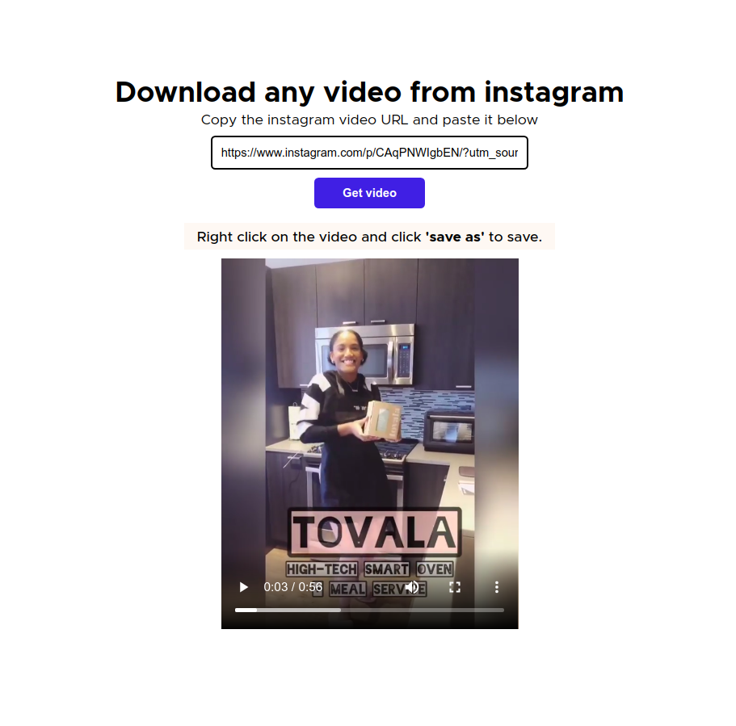

# IG.Download

A React app to download user videos from instagram.



## Built With

- React
- Node.js
- Express

## Video Demo


## Getting Started

**To get started, follow the instructions below**

To get a local copy up and running follow these simple example steps.

- Setup and run the API(see the api folder)

For the frontend:

- run

```
npm install
```

to install all packages. then

```
npm start
```

- to start the app in the browser.

### Prerequisites

- Node^8.0

### Automated Tests

- Run automated tests using `npm run test`

## Authors

👤 **Adebola**

- Github: [@githubhandle](https://github.com/onedebos)
- Twitter: [@twitterhandle](https://twitter.com/debosthefirst)
- Linkedin: [linkedin](https://www.linkedin.com/in/adebola-niran/)

## 🤝 Contributing

Contributions, issues and feature requests are welcome!

Feel free to check the [issues page](issues/).

## Show your support

Give a ⭐️ if you like this project!

## Acknowledgments

Naomi Thomas - @iamnaomithomas on instagram for using her video.

## 📝 License

This project is [MIT](lic.url) licensed.
